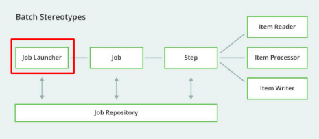

<p align="center">
  
</p>


# Objetivo

Parte 2 dos estudos de spring batch.

# Componentes Spring Batch

## Objetivo

Visão geral dos componentes que compõem o Spring Batch.

Compreender o ciclo de vida do Job e seus Steps.

## Spring Batch

Imagine um cenário:

Um sistema de uma grande empresa (amazon), que processa dezenas de milhares de pedidos todos os dias. Este processamento
deve ser rápido e confiável e deve funcionar sem interrupções.

## Componentes do Spring Batch


-Visão geral dos componentes do Spring Batch-

Referência: https://spring.io/batch

### Entendendo cada um dos componentes

#### Job


É o componente principal! Ele irá definir uma tarefa e como ela irá se comportar.

Um Job é uma aplicação que processa uma quantidade **finita** de dados sem **interação** ou **interrupção**.

Um Job, pode ser composto de vários Steps.

Pode também, ser compreendido como uma máquina de estados com sequência de steps (etapas) que irão possuir uma lógica
própria.


#### Step


Step representa uma etapa ou passo no qual uma lógica é executada.

Geralmente, eles são encadeados com o intuito de fornecer um resultado ao final de um processamento. Ou seja, sempre
esperamos que no final do step, ele nos dê algum resultado.

Temos dois tipos de Steps: tasklet e chunks.

##### Tasklet

Os baseados em tasklet são mais simples e geralmente não tem uma lógica complexa. 

Um bom exemplo pode ser impressão de mensagem ou algum log.

##### Chunks

Já os chunks são mais complexos e normalmente são quebrados em 3 etapas:

1. Leitura (ItemReader) - Leitura de um arquivo CSV, por exemplo;
2. Processamento (ItemProcessor) - Poderia remover dados, duplicatas desse CSV;
3. Escrita (ItemWriter) - Gravar dados em outra base dados, alimentar sistema.


Esse steps podem ser acompanhados de outros steps.

#### JobRepository


JobRepository irá manter o estado do Job (duração da execução, status, erros, etc.)

É também responsável por manter os metadados e são utilizados pelos componentes do framework para controlar o fluxo
de operação do Job.

#### JobLaucher



É responsável por executar o job! (geralmente por meio de agendamentos).

É possível definir parâmetros e propriedades da execução (variáveis de ambiente, por exemplo).

# Configurando MySQL com Docker compose

## Script Docker compose

[Link github](https://gist.github.com/oliveiralex/fe234f71d7e594ea83566cfb2625c180)

Para subir a estrutura

> docker-compose up -d

Parar a estrutura

> docker-compose down

Ou simplesmente coloque o arquivo na pasta do projeto, executa com o docker aberto e monte os containers.

Abra o ``localhost:5050`` e insira os dados abaixo:

### Dados de conexão (phpMyAdmin)

Server: mysql-docker
Usuário: root / user
Senha: 1234567

### Dados de conexão para o MySQL Workbench

Host: 127.0.0.1
Porta: 3307
Usuário: root / user

### Crie um banco de dados

Após logar, crie um banco de dados. Novo > e coloque o nome do banco (usaremos spring_batch).


Nesse banco de dados, é onde criaremos os nossos metadados.

# Estudo de caso - acessando metadados Spring Batch

Agora que criamos o banco de dados, iremos adaptar a nossa aplicação para se conectar a ele. Assim que iniciarmos o 
projeto, iremos visualizar esses metadados.

❗Inserir o MySQL driver como dependência.

Em ``application.properties``, colocar a nossa conexão com o banco de dados MySQL que criamos.

```properties
spring.datasource.url=jdbc:mysql://localhost:3307/spring_batch
spring.datasource.username=user/root
spring.datasource.password=1234567

# Criar as tabelas de metadados
spring.batch.jdbc.initialize-schema=always
```

Ao rodar a aplicação e voltar para o phpMyAdmin, podemos verificar as tabelas de metadados criadas!


## Tabelas metadados

Existem duas tabelas que são mais importantes:

1. BATCH_JOB_INSTANCE


Essa tabela nos mostrará a quantidade de execuções lógicas feitas desse Job. Teremos seu nome, ID e seu hash.

2. BATCH_JOB_EXECUTION


Teremos o ID de execução do Job, a versão, data de criação, seus status e mais.

Caso executássemos de novo a aplicação, se criaria outra instância desse Job (de ID 2).

❗Existem também as tabelas dos Steps com suas informações. Em steps complexos, ele pode acabar falhando em alguma etapa,
então podemos saber o possível ponto que esse Step falhou.

# Apresentação Projeto Leitura paginada

Construiremos um Job responsável por fazer uma requisição para uma API remota, buscar esses dados, processá-los e 
gravá-los em um banco de dados (no nosso caso, um banco MySQL).

Esse cenário, é um cenário clássico de integração de dados! (busca, processamento e input dos mesmos).

[Github introdutório](https://github.com/devsuperior/user-request-spring-batch)

[Projeto base](https://github.com/devsuperior/user-request-spring-batch/tree/main/clients/src/main)

❗Lembrar de inserir o docker-compose no escopo do projeto para criação de container.

O projeto acima já tem o repository/service/controller.

Implementaremos o Job para fazer a leitura dos dados (das consultas), para inserir eles no banco de dados.

## Configurando Job

Criar pacote job e a nossa classe JobConfig.

Terá dois parâmetros! JobRepository e o nosso Step.

No tocante ao Step, precisamos pensar: queremos um step que fará 03 etapas muito bem definidas.

A etapa de leitura, ele terá que consultar uma API remota e obter esses dados.

A etapa de processamento, iremos executar um processamento para selecionar campos específicos.

E a etapa de escrita, armazenar no banco de dados.

Seu nome será ``fetchUserDataAndStoreDbStep``! ❗É bom colocar nomes significativos ao criar Steps.

Dentro do método, teremos o JobBuilder com o sempre start (colocando o Step), incrementer e build.

```java
@Configuration
public class JobConfig {
    @Bean
    public Job job(JobRepository jobRepository, Step fetchUserDataAndStoreDBStep) {
        return new JobBuilder("job", jobRepository)
                .start(fetchUserDataAndStoreDBStep)
                .incrementer(new RunIdIncrementer())
                .build();
    }
}
```

## Configurando Step

No último exemplo, o nosso Step foi feito em tasklet (mais simples), dessa vez será em chunks.

Já sabemos que o chunk possui algumas etapas (leitura, processamento e escrita), utilizando o ItemReader, Processor e
Writer.

Eles são injetados no construtor. Só tem um problema, essas interfaces elas possuem um tipo, qual usar?

No caso em pauta, estamos fazendo uma requisição de uma API remota de clients. Se verificarmos o ClientDTO, podemos
observar os seus atributos:


Vamos criar uma classe espelho dessa ClientDTO! Ela não precisa ter o mesmo nome, mas precisa ter os mesmos atributos.

Assim, quando formos fazer a leitura, podemos pegar todos os campos dessa API remota a ser consultada.

Só criar um pacote dto e uma classe UserDTO.

Entenda, esse UserDTO será uma cópia fiel dos dados que iremos buscar na API remota.

```java
public class UserDTO {

    private Long id;
    private String login;
    private String name;
    private String location;
    private String avatarUrl;
    private Integer followers;
    private Integer following;
    private Instant createdAt;
    private String reposUrl;
    private String company;
    
    //construtor vazio + com argumentos
    //++ getters and setters e toString
}
```

Agora sim! Voltando para o Step, o ItemReader terá seu tipo de UserDTO.

Para definir o tamanho do chunk, só colocar no application.properties e criar uma variável dentro da classe Step.

Quando formos buscar os dados na API remota, será utilizando o valor do chunkSize (de 10 em 10, por exemplo).

❗O valor do chunk precisa ser em função do tamanho da página a ser pesquisada.

Exemplo: se o Size da URI for 10 e o chunksize for 5, teremos dois chunks.

## Configurando ItemReader (conectando na API remota)

Criaremos uma classe ``FetchUserDataReaderConfig`` no pacote reader. Ela implementará ``ItemReader<UserDTO>``, visto que
já sabemos que o UserDTO será uma cópia dos dados consultados.

A primeira coisa, é criar um método para conectar na API remota. Chameremos de "fetchUserDataFromAPI".

Ele usará o RestTemplate.

### RestTemplate - Objeto para realizar chamadas HTTP.

Faz parte do Spring Web, é um cliente http que iremos utilizar e conseguir conectar na API remota que está na nossa 
máquina (mas poderia estar em qualquer outro servidor da web).

O RestTemplate nos permite usar o ``.exchange()``, dentro dele iremos passar:

1. A Uri (com format, passando o número de página);
2. Método HTTP (neste caso, GET);
3. null;
4. O quarto argumento é o tipo que queremos buscar. No nosso caso, sabemos que a requisição do Postman retorna uma lista
de content (itens estão encapsulados), veja:


Faremos uma classe para obter o parâmetro desse content. Ela se irá se chamar ResponseUser (pacote domain).

```java
public class ResponseUser {
    
    //content, pois a lista do Postman tem esse nome
    private List<UserDTO> content;
    
    public List<UserDTO> getContent() {
        return content;
    }
}
```

Voltando para a FetchUserDataReader, passaremos a classe criada no quarto parâmetro da seguinte forma 
``new ParameterizedTypeReference<ResponseUser>() {});``. Após isso, o método fica pronto. Esse RestTemplate com exchange,
retornará um ``ResponseEntity<ResponseUser>``, então alocaremos em uma variável.

Depois, é só criar uma ``List<UserDTO>`` e dar um ``response.getBody().getContent();``


Agora, implementaremos o método read (da interface ItemReader)

### Função read

Um chunk terá vários registros, para cada registro (usuário) a função read do ItemReader será chamada.


Precisamos criar uma lógica para que enquanto tivermos registro na nossa lista de Users, a gente retorne um objeto User.

Primeiro, vamos criar a lista para armazenar esses usuários (fora do escopo mesmo).

Depois, criaremos um índice para percorrer a lista. Afinal, quando os dados acabarem (for null), encerraremos.

Resumo:

A função read irá ler os dados da lista de Users (um por um), caso a posição da lista for maior que o userIndex (que
está sendo incrementado), instanciaremos um User.

Quando a posição do index for maior que a lista, retornaremos null.

### Lidando com eventos Spring Batch - Carregando a lista Users (Before and After Chunk)

Assim que buscamos os dados na API e sabemos o tamanho do chunk, queremos carregar a nossa lista de users. 

Para isso, iremos trabalhar com eventos que pode nos auxiliar. Quem define o evento, é o **batch!**

Ou seja, assim que chamarmos nosso batch, podemos carregar a nossa lista de Users.

Teremos um evento antes de chamar o chunk (BeforeChunk).

#### BeforeChunk

Assim como o chunkSize está definido no properties, coloque também o ``pageSize=10``.

Esse evento ficará no finalzinho da classe, veja:


Voltando para a função da API, colocaremos agora o pageSize no primeiro parâmetro do exchange (dentro do String format):


Agora, teremos outro evento! O AfterChunk, afinal a page precisa ser incrementada a cada chamada.

#### AfterCunk

Criar um método para incrementar a page e um get para o pageSize que criamos lá em cima:


Método:


## Resumo ItemReader

[Código](https://github.com/zenonxd/estudo-spring-batch-APIremota/blob/master/user-request-springbatch/src/main/java/com/devsuperior/userrequestspringbatch/reader/FetchUserDataReaderConfig.java)

Esse leitor de batch realiza as seguintes tarefas em cada chunk:

Busca Dados da API: Antes de processar o chunk, faz requisições para carregar a lista users com dados da API.

Leitura Sequencial: O método read() lê um usuário de cada vez da lista users até o final do chunk.

Preparação para o Próximo Chunk: Após cada chunk, incrementa a página, reseta userIndex e limpa users.

### Atributos

1. BASE_URL: A URL base do servidor onde está a API.

```java
private final String BASE_URL = "http://localhost:8081";
```

2. RestTemplate: Objeto para realizar chamadas HTTP.

```java
private RestTemplate restTemplate = new RestTemplate();
```

3. Variáveis de Controle:

- page: controla a página atual dos dados a serem buscados.
- users: armazena temporariamente os dados de UserDTO obtidos da API para o chunk atual.
- userIndex: índice do usuário atual na lista users.

```java
private int page = 0;
private List<UserDTO> users = new ArrayList<>();
private int userIndex = 0;
```

4. Parâmetros Configuráveis (via @Value):

- chunkSize: define o tamanho do chunk, ou seja, quantos usuários processar por vez.
- pageSize: define quantos registros são obtidos por vez da API.

```java
@Value("${chunkSize}")
private int chunkSize;

@Value("${pageSize}")
private int pageSize;
```

### Método read()

O método read() é a implementação do método de leitura da interface ItemReader. Ele lê um único UserDTO da lista users e avança o índice (userIndex).


```java
@Override
public UserDTO read() throws Exception, UnexpectedInputException, ParseException, NonTransientResourceException {
UserDTO user;

    if (userIndex < users.size()) {
        user = users.get(userIndex);
    } else {
        user = null;
    }

    userIndex++;

    return user;
}
```

1. Verifica se há usuários na lista users: Se userIndex é menor que users.size(), retorna o usuário atual.
2. Incrementa userIndex: Avança o índice para a próxima chamada de leitura.
3. Retorna null ao final: Quando userIndex ultrapassa o tamanho da lista, retorna null, indicando o fim dos dados no chunk.

### Método fetchUserDataFromAPI()

Este método realiza uma chamada à API para buscar uma lista de UserDTO com base na página e no tamanho da página (pageSize).

```java
private List<UserDTO> fetchUserDataFromAPI() {
String uri = BASE_URL + "/clients/pagedData?page=%d&size=%d";

    ResponseEntity<ResponseUser> response = restTemplate.exchange(
        String.format(uri, getPage(), pageSize),
        HttpMethod.GET,
        null,
        new ParameterizedTypeReference<ResponseUser>() {}
    );

    List<UserDTO> result = response.getBody().getContent();
    return result;
}
```

Constrói a URL com parâmetros de página: Usa String.format para construir a URL com os valores de page e pageSize.

Faz uma requisição GET: Usa RestTemplate para fazer a chamada GET e obter uma lista de UserDTO encapsulada em ResponseUser.

Retorna a lista de UserDTO: Extrai a lista de usuários da resposta e a retorna.

### Métodos getPage() e incrementPage()

Estes métodos são auxiliares para controlar o número da página:


```java
public int getPage() {
return page;
}

public void incrementPage() {
this.page++;
}
```
- getPage(): Retorna o valor atual da página.
- incrementPage(): Incrementa o valor da página para carregar dados da próxima página na próxima chamada.

### Métodos beforeChunk e afterChunk

Estes métodos anotados com @BeforeChunk e @AfterChunk são executados antes e depois de cada chunk. Eles organizam o 
carregamento e reset dos dados da lista users a cada chunk.

#### Método beforeChunk()

Antes do processamento do chunk, beforeChunk carrega usuários da API até preencher o tamanho do chunk (chunkSize).

```java
@BeforeChunk
public void beforeChunk(ChunkContext context) {
    for (int i = 0; i < chunkSize; i += pageSize) {
        users.addAll(fetchUserDataFromAPI());
    }
}
```

1. Loop com incremento do tamanho da página: Carrega dados em partes até preencher o chunkSize.
2. Chama fetchUserDataFromAPI(): Busca dados da API e os adiciona na lista users.

#### Método afterChunk()

Após o chunk ser processado, afterChunk realiza algumas ações de reset para preparar o leitor para o próximo chunk.

```java
@AfterChunk
public void afterChunk(ChunkContext context) {
    incrementPage();
    userIndex = 0;
    users.clear();
}
```
1. incrementPage(): Incrementa a página para o próximo chunk.
2. Reseta userIndex para 0: Começa a leitura do próximo chunk do início da lista users.
3. Limpa a lista users: Remove todos os usuários para liberar memória e evitar dados duplicados no próximo chunk.

## Sequência de execução

1. Inicialização:

O FetchUserDataReaderConfig é configurado como um ItemReader e implementa a interface ItemReader<UserDTO>.

Variáveis page, users e userIndex são inicializadas para controlar a página atual da API, armazenar a lista de usuários 
retornada pela API e o índice do usuário que será processado em cada chunk.

2. Início do Chunk (Antes de Processar o Chunk) (beforeChunk):

Esse método é executado antes do processamento de cada chunk.

A função beforeChunk carrega dados na lista users conforme o tamanho de chunkSize, realizando múltiplas chamadas à API se necessário.

A API é chamada através do método fetchUserDataFromAPI, que incrementa a página conforme necessário para preencher 
users com o número de registros indicado em chunkSize.

Isso garante que o chunk tenha dados suficientes para ser processado de acordo com o tamanho configurado.

3. Leitura de Dados (read):

O método read é chamado repetidamente pelo Spring Batch para ler cada item do chunk atual.

Cada chamada a read retorna um usuário (UserDTO) da lista users.

A lista users é percorrida usando userIndex, e a cada leitura, userIndex é incrementado.

Quando userIndex atinge o tamanho de users, o método read retorna null, indicando que todos os dados do chunk atual foram lidos.

4. Fim do Chunk (Depois de Processar o Chunk) (afterChunk):

Esse método é executado após o processamento do chunk.

Ele incrementa o número da página (incrementPage) para garantir que na próxima chamada da API uma nova página de dados seja buscada.

Ele também reseta userIndex para 0 e limpa a lista users, preparando-a para o próximo chunk.

## E a lista com 60 users, com chunkSize 10?

Se a lista de usuários tiver 60 registros e o chunkSize estiver configurado para 10, o Spring Batch vai processar os 
dados em chunks (ou lotes) de 10 usuários por vez. Abaixo, explico em detalhes como o código funcionaria neste cenário:

1. Configuração inicial:

- pageSize: Número de registros que serão buscados por vez da API. Vamos assumir, por exemplo, que pageSize é 10.
- chunkSize: Número de registros que o Spring Batch vai processar em cada chunk, configurado como 10. 

Dessa forma, o leitor vai buscar dados suficientes para preencher chunks de tamanho 10, mas com chamadas à API que 
busquem múltiplos registros (10 por vez, conforme pageSize).

2. Sequência de Execução em Cada Chunk

### Primeiro Chunk
   
1. beforeChunk é executado:

Como o chunkSize é 10, e o pageSize também é 10, o código faz uma chamada à API (fetchUserDataFromAPI), retornando os 
primeiros 10 usuários da página 0.

Esses 10 usuários são adicionados à lista users.

2. read é chamado repetidamente:

O read é executado 10 vezes, lendo um usuário da lista users por vez até atingir o tamanho do chunkSize.

A cada execução de read, userIndex é incrementado para ler o próximo usuário da lista users.

Após 10 leituras, userIndex atinge o tamanho de chunkSize, e read retorna null, indicando que o chunk foi processado.

3. afterChunk é executado:

Ao final do chunk, afterChunk é chamado:

incrementPage() incrementa page de 0 para 1, indicando que a próxima chamada à API deve buscar a próxima página de dados.

userIndex é resetado para 0.

A lista users é limpa para preparar o próximo chunk.

### Segundo Chunk

1. beforeChunk é executado novamente:

O código agora chama a API com page = 1 e pageSize = 10, buscando os próximos 10 usuários (usuários 11 a 20).

Esses 10 usuários são adicionados à lista users.

2. read é chamado novamente:

read é chamado mais 10 vezes, processando o segundo conjunto de 10 usuários.

Após 10 leituras, read retorna null novamente.

3. afterChunk é executado:

Incrementa page para 2.

Reseta userIndex para 0 e limpa users.

Repetição do Ciclo para os Próximos Chunks

Esse ciclo se repete, processando 10 usuários por vez, até que todos os 60 usuários sejam processados. Ou seja:

- Terceiro Chunk: Processa usuários 21 a 30.
- Quarto Chunk: Processa usuários 31 a 40.
- Quinto Chunk: Processa usuários 41 a 50.
- Sexto Chunk: Processa usuários 51 a 60.
- 
Após o sexto chunk, todos os usuários foram processados, e o Spring Batch finaliza o job.

Resumo da Sequência:

- 6 chunks serão processados no total, cada um com 10 usuários.
- Cada chunk faz uma chamada à API para preencher a lista users com 10 registros.
- Após cada chunk, page é incrementado, e users é limpado para a próxima execução do chunk.